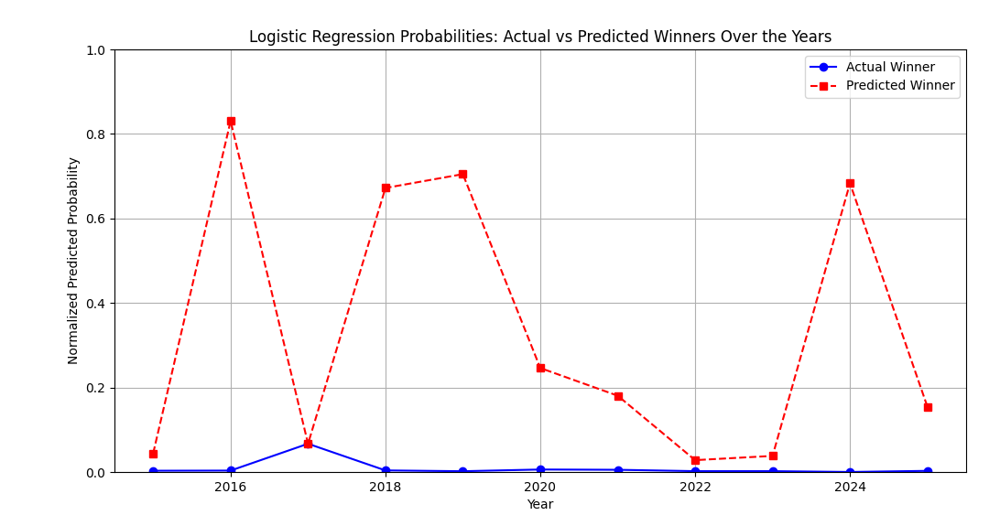
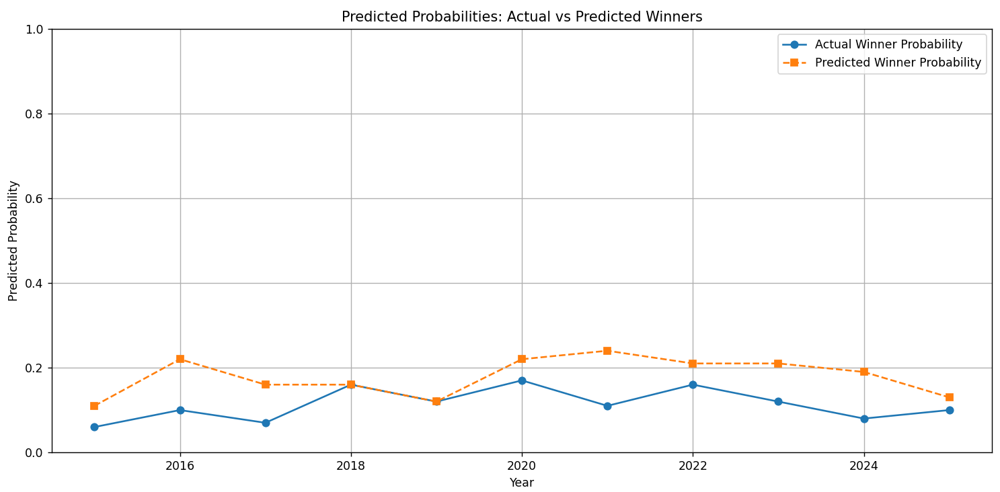
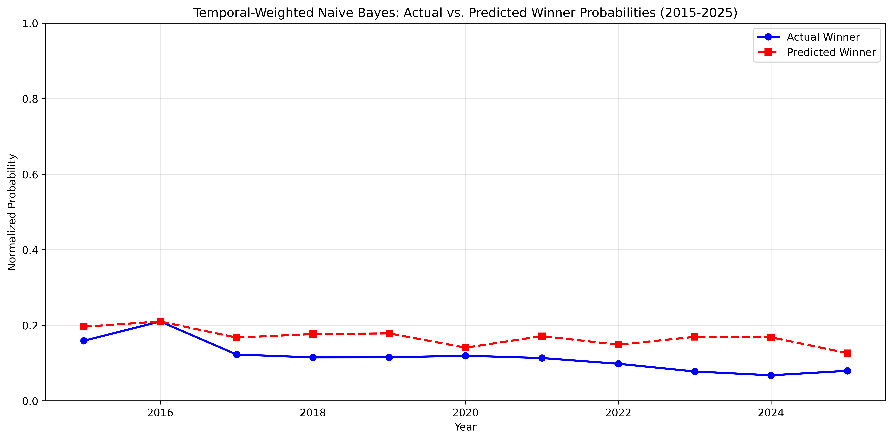
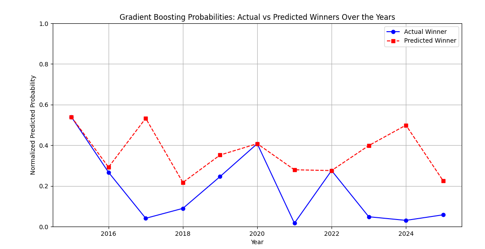
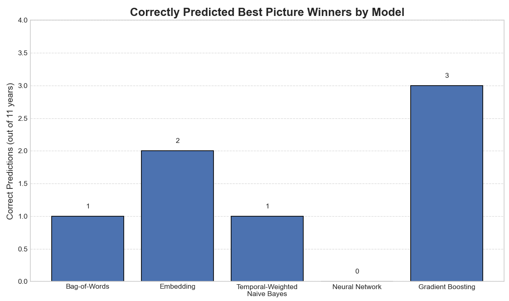

<h1 align="center">Hollywood 5</h1>
<h2 align="center">By Orlando Di Leo, Matias Ibarburu, Luke McDonald, Daniel Urrutia, Jisoo Yoo</h2>
<p align="center">  </p>
<h2 align="center">Project Description</h2>

<p align="justify">
Our goal is to build a model that predicts whether an Oscar-nominated film will win Best Picture based on audience sentiment and engagement. We use data from Letterboxd reviews to extract patterns in how viewers talk about nominated films. The hypothesis is that emotional tone, review volume, and fan engagement — combined with basic film metadata — can reveal subtle signals that align with Oscar outcomes. By focusing on reviews published only before each year's ceremony, we aim to simulate a real-world prediction setting.
</p>

<h2 align="center">Goal</h2>

We aim to predict which film will win Best Picture based on review text. For each Oscar year, we output a probability for each nominee and identify the predicted winner as the film with the highest probability in its pool.

<h3>Target Metrics</h3>
<b>Average probability of the actual winner</b>
How strongly the model “believes” in the true winner, even if it doesn't place it first. If the winner always gets 0.10 probability out of 10 films, that’s weak; if it often gets 0.60+, that is better.

<b>Winner correctly predicted (top-ranked)</b>
Whether the model actually picks the correct film as the most likely winner; our main goal from a practical standpoint. Even if a model assigns high probability to the right movie, it will not get chosen as the predicted winner if another film edges it out every time.

<b>Why these over ROC/AUC?</b>
ROC curves and AUC are useful for binary classification problems across many thresholds, however in this context they are not as effective:
- The competition is within each year’s nominee pool, not across all films globally.
- ROC/AUC assume a global positive vs. negative class structure, but we are predicting a winner among multiple nominees in a single year which is a mutually exclusive choice.
- Even strong ROC scores wouldn't guarantee we pick the actual winner in a given year; it might just mean we consistently rank winners slightly higher overall.

Thus, our metrics are tailored to finding confidence in and predicting the correct winner accross years.

---

<h2 align="center">The Data</h2>

<h3 align="left">Sources</h3>

- Our **Oscars award data** was manually compiled from the <a href="https://www.oscars.org">official Academy Awards website</a> for the years 2015-2025, which records the title of each nominee and the eventual winners.
- The **Viewer reviews and film metadata** were scraped from <a href="https://letterboxd.com/films/">Letterboxd.com</a>, a film-reviewing site similar to Goodreads. It also has an info page for each film with metadata that we scraped and compiled.

<h3>Data Access</h3>

<ul>
    <li>
        The dataset used for training and evaluation (required to run models) can be downloaded from this Box link:
        <a href="https://utexas.box.com/s/3dqb178rcmvwobr9u0j7ydg89h0op5hy" target="_blank">
            Download Dataset
        </a>.
    </li>
    <li>
        The full dataset of all scraped reviews (not required to run the models) is available here:
        <a href="https://utexas.box.com/shared/static/13d76lq4iju268a2pcxprd3wrljtok5k.csv" target="_blank">
            Download Full Review Data
        </a>.
    </li>
</ul>

Please contact the authors for any issues with data retrieval. The data is not uploaded to the repository due to size constraints (>100Mb).

<h3 align="left">Features</h3>
<ul>
  <li>Description and genre of film, taken from Letterboxd</li>
  <li>Combined text of 10,000 reviews per Best Picture nominee (for NLP analysis)</li>
  <li>List of cast members and studios (as categorical features)</li>
  <li>Binary outcome (1 = winner, 0 = nominee that did not win)</li>
</ul>


<h3 align="left">Methodology</h3>


<ol>
  <li>First, we scraped the nominees for Best Picture from 2015 to 2025 from the official Academy Awards website, encoding whether they won or not in our binary outcome variable. We also scraped the Oscars ceremony date for each year, so that we can filter out post-ceremony reviews later.</li>
  <li>Then, using our knowledge of Letterboxd's standard formatting, we added the Letterboxd URLs for each film into a data set to use for our scraper.</li>
  <li>We scraped reviews by looping through each rating category (e.g., 5 stars, 4.5 stars, etc.) on the Letterboxd film page, beginning with the oldest reviews first. Letterboxd limits reviews after approximately 30,000 reviews for each rating category, so this process allowed us to get more data than we would have otherwise. For each category, we paginated through all available reviews, extracting the review text, user, rating, and date, then saved them in batches to avoid data loss.
  <li>Using a <code>requests</code> scraper, we then gathered film metadata such as the description text, the genre, cast names, and studio names.</li>
<li>
  We then combined the data from steps (3) and (4) into a master data set. This involved standardizing the "time posted" data for the reviews, filtering for reviews posted before the given year's ceremony date, and combining 10,000 randomly selected English-language reviews into a single text parameter for NLP processing.
  <div style="margin-left: 2em;">
    - At first, we tried taking the random sample before actually translating non-English reviews, but we lacked the processing power to pull it off.
  </div>
  <div style="margin-left: 2em;">
    - We then pivoted to the approach of using <code>langdetect</code> in conjunction with <code>swifter</code> to simply filter out non-English reviews <em>before</em> taking our sample, massively simplifying the process and reducing our runtime.
  </div>
</li>

  <li>To determine the best model for predicting the Acadamy Award for Best Picture, we used a leave-one-year-out approach from 2015 to 2024. Each year, we trained on the other years and predicted the winner from that year's nominees. Our main metric was the number of years where the model correctly identified the actual winner. Since only one nominee wins each year, we focused on correctly selecting that winner rather than overall classification performance.  </li>
</ol>

<h3>Test-Train Split methodology</h3>

In our model, we implemented a year-wise test-train split. Specifically, for each year, we trained the model on data from all other years and tested it on the nominated films of the selected test year. This approach mimics the real-world scenario of predicting future outcomes, where data from future events (in this case, Oscar winners) is unavailable during training.

This method reflects how predictions are made in practice. When predicting a future Oscar winner, we only have access to reviews and movies from other Oscar periods, and this approach aligns with that constraint. To that end, we also only use data from before the Oscar winners are announced, since reviews after the announcement may be fundamentally different than those before the announcement.

Probabilities are normalized within each year so that the total probability across all nominees in a given year sums to 1. The predicted winner is the film with the highest probability in that year’s nominee pool.

<h3>Stop Words</h3>

<p>In building the text classification model, special attention was paid to the construction of the stop words list, which plays a critical role in filtering out non-informative tokens that could bias the results. We started with the standard set of English stop words provided by <strong>Natural Language Toolkit</strong> (<code>NLTK</code>) and expanded it by incorporating specific terms from the dataset:
<ul>
  <li>
    <strong>Film names were always excluded</strong> (i.e., always added to the stop words list) across all model specifications. This decision was made because film titles are likely to appear frequently in their own reviews, which could introduce strong but misleading signals about the outcome (i.e., whether the film won Best Picture). Removing these names helped prevent the model from by simply picking up title mentions rather than learning other patterns.
  </li>
  <li>
    <strong>Cast members and studios were tested experimentally.</strong> We explored different stop word configurations to assess whether including or excluding these names would improve performance. These were included or excluded on a per-model basis.
  </li>
</ul>
It is worth noting that while excluding film names helped avoid overfitting to title mentions, this approach may also have <strong>limited the model’s ability to detect meaningful comparisons across films</strong>. For example, reviews that favorably compare one film to another might lose critical context if both film names are removed. This trade-off between reducing noise and preserving valuable comparative signals was an important part of our modeling choices.

<h3>Limitations</h3>

- Due to computing limitations, we restrict our analysis to only best-picture awards. Though the models in this analysis could be easily extended to target other categories as well.
- Audience behavior may shift after nominations are announced, even before winners are revealed—introducing possible bias despite our review cutoff. We could implement some interaction term for reviews after to see if that helps our predicition at all.
- Our models are limited to the random sample of reviews, for the purpose of making it reasonable to process our data. With more time, or a more powerful machine, we could take the entire data set at face value and perhaps construct a more accurate profile of the public perception of the films.
- With our method, we do not take into account the sentiments of foreign-language reviewers, eliminating a significant (~30) percentage of our data set. Distinct national trends could affect the efficacy of our models.
- Audience behavior may shift after nominations are announced, even before winners are revealed—introducing possible bias despite our review cutoff.
- Letterboxd skews toward younger, internet-savvy users and may not reflect Academy preferences.
- Review volume varies across films, especially in smaller or foreign-language categories.
- NLP models may misinterpret sarcasm, humor, or inside references common in user-generated reviews.
- For the embedding model, we are only using 100 reviews per movie for processing time reasons. While there is more data available, it could take several hours to run each model as more reviews are added. A longer dataset is available at [this Box link](https://utexas.app.box.com/s/b86722f1hoxeqy76dqw3ckfga09iqwfz/file/1853007371343).
- Some Letterboxd reviews are likely trolls or unserious users who are not putting real reviews. Nothing was done to clean these potentially non-meaningful reviews.

<h2 align="center">The Model(s)</h2>


<h3>Bag-of-Words with Logistic Regression Classifier</h3>

Implements scikit-learn's CountVectorizer and LogisticRegressionCV to predict Academy Awards Best Picture winners based on Letterboxd text reviews. CountVectorizer transforms raw text into a matrix of token counts, creating columns for each unique word or phrase and recording how often it appears in each document. This model is also referred to as a Bag-of-Words model because we are collecting the word/phrase counts in no particular order. Since the Oscars are partially driven by subjective critical acclaim, a simple bag-of-words approach can offer a surprisingly strong baseline by capturing patterns in how reviewers describe the nominees.

To prepare the input, we merged all English-language reviews for each film nominee into a single document, separating individual reviews with spaces. This aggregated text format was used for all models except the embedding model discussed below. We configured CountVectorizer to extract both unigrams (1-word tokens) and bigrams (2-word tokens) to better capture simple sentiment structures—e.g., distinguishing "the acting was great" from "the acting was not great".

Another model choice was removing certain stop words. In this model, we used the default english stop words from scikitlearn CountVectorizer along with some additional choice stop words including: film names, cast names, and studio names from all films in the dataset. This choice was made after initial results found many of the important features to be movie or actor names, which would not accurately predict the best movie for another year. A minimum number of token appearances was set to 10 to remove any words that do not appear frequently. Lastly, the model uses a logistic regression classifier using ridge regularization to weight each of the features. LogisticRegressionCV automatically performs cross-validation to select the optimal regularization strength. This helps prevent overfitting by penalizing large coefficients.

<h3>Embedding Model with Logistic Regression Classifier</h3>

Implements SentenceTransformers' all-MiniLM-L12-v2 pretrained embedding model to predict Academy Awards Best Picture winners based on Letterboxd text reviews. This transformer-based model is pretrained on billions of sentences, making it well-suited to capturing semantic meaning in movie reviews. Instead of treating reviews as a bags of words, the model generates  vector representations (embeddings) to reflect the contextual meaning of each review.

Each individual review is passed through the embedding model to produce a fixed-length vector. We then aggregate these review-level vectors for each film by taking their mean, resulting in a single semantic embedding per nominee. This aggregation helps summarize the overall sentiment and thematic content of a film’s reviews in a compact form.

Unlike the CountVectorizer approach, this method requires keeping reviews separate before embedding, since averaging already-merged text would distort individual sentiment signals. As such, the input data for this model maintains one row per review. For processing reasons, we limit the data to 100 reviews per movie.

Lastly, the resulting film-level embeddings are fed into a logistic regression classifier with ridge regularization. LogisticRegressionCV performs cross-validation to automatically select the optimal strength of regularization. This helps control for overfitting by shrinking less important feature weights toward zero, improving the model’s generalization to other Oscar years.

<h3>Temporal-Weighted Naive Bayes</h3>

This model predicts Best Picture winners using Tfidf Vectorizer and Multinomial Naive Bayes. The TFIDF vector converts the metadata of all reviews into numerical count to predict OScar nominee awards based on common words. However, we use stopwords to avoid words from the title of the movie or some generic words to avoid overfitting or overgeneralizing words that would be included in reviews. 


Additionally, we weight training examples using a temporal decay factor to give slightly more emphasis to years closer to the test year. This ensures predictions are informed by recent language trends while still generalizing across the 2015–2025 period. While extending stopwords to the studio or cast names may also help, since the year of nomination is excluded in this model, it is unlikely that the same cast names would be in future or past movies' reviews, and might instead be helpful. Initial trials of the model supported this theory as prediction accuracy decreased. 

Since reviews can vary in tone and depth, we were able to utilize Textblob, which is a python package with a built-in dictionary with predefined sentiment scores (scores about positive or negative feelings) and subjectivity (how differently opinionated a review is relative to other reviews). This allowed us to boost or reduce the model's predicted win probabilities as reviews got more positive and subjective (analyzing words like "amazing" or "terrible"). Additionally, setting the function for adding sentiment "grams" to have groupings allowed us to look at nearby words that are useful, like "not" or "very" before or after key words. 

Finally, the model also adjusts the weight of each word to avoid too high or overconfidence of a predictor word. By using Naive Bayes with filters, we focus on words said in at least 5 movie reviews (avoid too rare of words or misspelled words) and words said in over 70% of reviews (too common or not clear words). Additionally, the model normalizes probability so that all probabilities of available movies sum to 1, including a step that prevents the probability of each word occuring from equalling zero (artificially adding a tiny ocurrence of 0.1). That way, the proportion of each words uniqueness is lower.


<h3>Gradient Boosting</h3>

Implements scikit learn's GradientBoostingClassifier to predict Best Picture winners based on Letterboxd text reviews. Gradient boosting builds a sequence of shallow decision trees, where each new tree tries to correct the mistakes of the previous ones. This approach is well-suited to high-dimensional data (thousands of text features) and can identify subtle signals in review language—such as combinations of words or phrases that may indicate stronger Oscar prospects.

In our context, movie reviews can contain complex patterns and nuance in language. Additionally, the structure or reviews can vary vastly between users. Thus Gradient Boosting is particularly effective in capturing these non-linear relationships in the data, allowing it to outperform simpler models like logistic regression.

The model is configured with parameters, such as max_depth, min_samples_split, and learning_rate, which help prevent overfitting. GridSerachCV was used to optimize hyperparameters, then best parameters were manually inserted into the model for ease of running. These hyperparameters are particularly useful in this context, where the dataset may contain high-dimensional features (e.g., words in reviews) that could lead to overfitting in simpler models. However, it is still prone to overfitting in our setting since there are not that many target years, even though there are many features (words).

---

<h2 align="center">Results </h2>

<h3>Bag-of-Words with Logistic Regression Classifier</h3>

<b>Years Correctly Predicted: 0</b>
<b>Average True Winner Probability: ~.01</b>

Out of 11 years, the Gradient Boosting model predicted the Best Picture winner correctly in 0 years (0% accuracy). The basic Bag-of-Words model appears to struggle in predicting correct winners. This could be because commonly used words in Letterboxd reviews for one year of nominees could be vastly different than other years. Therefore, a simple count aggregation of words is not enough to explain why a certain movie won in a given year.



<h3>Embedding Model with Logistic Regression Classifier</h3>

<b>Years Correctly Predicted: 2</b>
<b>Average True Winner Probability: ~.15</b>

Out of 11 years, the embedding model predicted the Best Picture winner correctly in 2 years (18% accuracy). This model uses SentenceTransformers’ all-MiniLM-L12-v2 to generate semantic vector representations of individual Letterboxd reviews. These vectors capture deeper contextual meaning than simple word counts, allowing the model to better identify sentiment and themes across reviews. The model performs better than the simple Bag-of-Words model but still only predicts 2 correctly. This suggests that semantic embeddings may better reflect the nuanced language of film criticism, but further improvements such as ensemble strategies may be necessary to boost accuracy.




<h3>Temporal-Weighted Naive Bayes</h3>

<b>Years Correctly Predicted: 1</b>
<b>Average True Winner Probability: ~.12</b>

Out of 11 years, the Naive Bayes model correctly predicted the Best Picture winner in only 1 year (9% accuracy). The model uses a TF-IDF vectorizer and Multinomial Naive Bayes classifier to analyze review text written before the Oscar ceremony. While it integrates sentiment features, the model often failed to identify the actual winner even as a close runner-up. This suggests that important cues—such as cast, studio, or director mentions—may be highly predictive yet were deliberately excluded to reduce overfitting across years. As a result, the model may miss key year-specific context that shapes audience perceptions of Oscar-worthiness. Additionally, the model did better in early years and worse in later years, potentially suggesting that the exponential weight was less successful when comparing further apart years and that language style text is somewhat consistent.



<h3>Gradient Boosting</h3>

<b>Years Correctly Predicted: 3</b>
<b>Average True Winner Probability: ~.28</b>

Out of 11 years, the Gradient Boosting model predicted the Best Picture winner correctly in 3 years (27% accuracy). Even in years it missed the winner, the model still ranked the correct film within the top 3 contenders 4 of the remaining 8 years. While the exact prediction rate was modest, the model was consistently able to highlight strong candidates, offering valuable insights into potential Oscar winners.



---

<h2 align="center"> Discussion </h2>
=======
Overall, each of our models provides only modest results. Our models capture what’s available in the text, but many of the true predictors of award success lie outside the scope of this data. Factors like industry politics, marketing campaigns, historical trends, and the preferences of Academy voters likely play a much bigger role than what’s said in public reviews. It's possible that reviews which are a proxy for the quality of a movie doesn't sway several academy voters, per the fact that <a href="https://www.npr.org/2025/04/22/nx-s1-5372650/oscar-voting-changes" target="_blank">Academy voters were not required to watch movies they are voting on until 2026</a>.




The Gradient Boosting model performed the best. Out of the 11 years of Oscar ceremonies studied, the model correctly predicted 3 of the 11 winners and 7 out of 11 as the top three most probable to win. We believe this is due to XYZ

Among our modest results, the <b>Gradient Boosting model</b> performed the best. Out of the 11 years of Oscar ceremonies studied, the model correctly predicted 3 of the 11 winners and 7 out of 11 as the top three most probable to win. When we vectorize the movie reviews, the resulting vector is a sparse and discontinuous; most words don’t appear in most reviews, which means there are a lot of zeros. This makes it difficult for simple models like logistic regression or NB, which expect smooth, linear patterns, to pick up on signals in the text.

Gradient boosting models handle this much better through use of many smaller decision trees, it can find important words (or combinations of words) and adjust as it learns through iterations. These models are especially good at dealing with the discontinuous nature of text data where a few words or phrases may be most important and formatted in complicated, non-linear patterns, which could be why Gradient Boosting out performed other models. However it is also possible that the model became overtuned to our set over iterations.

Interestingly, some consistencies popped up across models. For example 4 out of 5 of our models predicted the Revenant to win the 2016 Academy Award for Best Picture, even though Spotlight was the true winner. There are no other instances of each of the models consistently choosing a wrong winner like 2016.

---

<h2 align="center">Reproducing the Results</h2>

**The required Python packages are:**
- **pandas** – for data manipulation and analysis  
- **numpy** – for numerical computations  
- **requests** – for making HTTP requests to fetch web pages  
- **beautifulsoup4** – for parsing HTML and extracting data from web pages  
- **scikit-learn** – for modeling and data preprocessing  
- **nltk** – for natural language processing tasks like tokenization and stop word removal  
- **sentence-transformers** – for generating semantic embeddings from text reviews  
- **matplotlib** – for creating visualizations  
- **langdetect** – for identifying the language of film reviews  
- **swifter** – for efficiently applying functions to a pandas DataFrame  
- **tqdm** – for tracking the progress of any number of processes  
- **re** – for working with regular expressions and text cleaning  
- **os** – for interacting with the operating system and handling file paths  
- **heapq** – for efficient heap queue operations  
- **unicodedata** – for normalizing and cleaning Unicode text  
- **string** – for string constants and text processing utilities  
- **datetime** – for handling and formatting date and time information  
- **pathlib** – for working with and navigating file system paths  
- **collections** – for specialized data structures like defaultdict  
- **csv** – for reading and writing CSV files  
- **ftfy** – for fixing Unicode errors and messy text in scraped reviews  
- **threading** – for multi-threaded execution  
- **concurrent.futures** – for parallelizing tasks across multiple threads  
- **urllib.parse** – for parsing and manipulating URLs

These can be installed using pip (or pip3):  

```bash
pip install pandas requests beautifulsoup4 scikit-learn langdetect swifter tqdm heapq unicodedata datetime pathlib collections ftfy threading concurrent.futures urllib.parse
```

**Additional setup:**  
To use `nltk`, you'll also need to download the relevant datasets:

```python
import nltk
nltk.download('punkt')
nltk.download('stopwords')
```


### Running the Models

<ol>
    <li>
        Clone the repository to your local machine:
    </li>
    <li>
        Download the cleaned concatenated dataset at this link:
        <a href="https://utexas.box.com/s/3dqb178rcmvwobr9u0j7ydg89h0op5hy" target="_blank">
            Download Concatenated Dataset
        </a> and save it in the folder 'Data'
    </li>
    <li>
        Download the cleaned embedding dataset at this link:
        <a href="https://utexas.box.com/s/3dqb178rcmvwobr9u0j7ydg89h0op5hy" target="_blank">
            Download Embedding Dataset
        </a> and save it in the folder 'Data'
    </li>
</ol>

